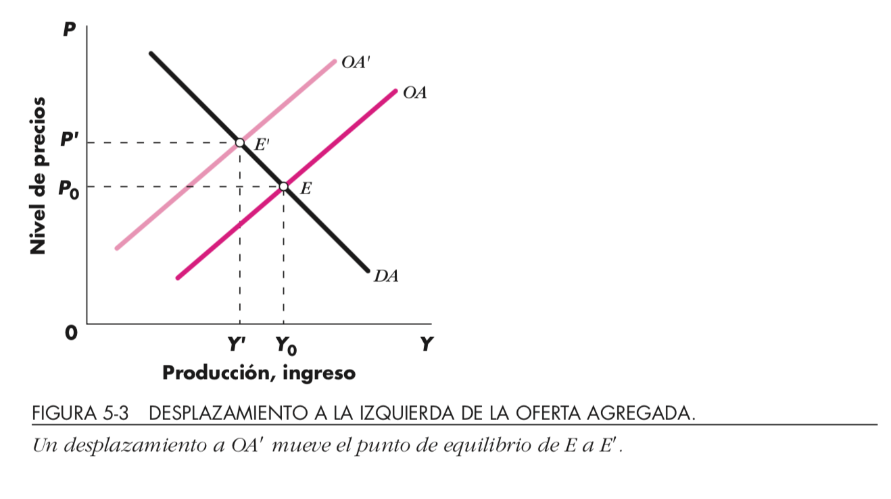
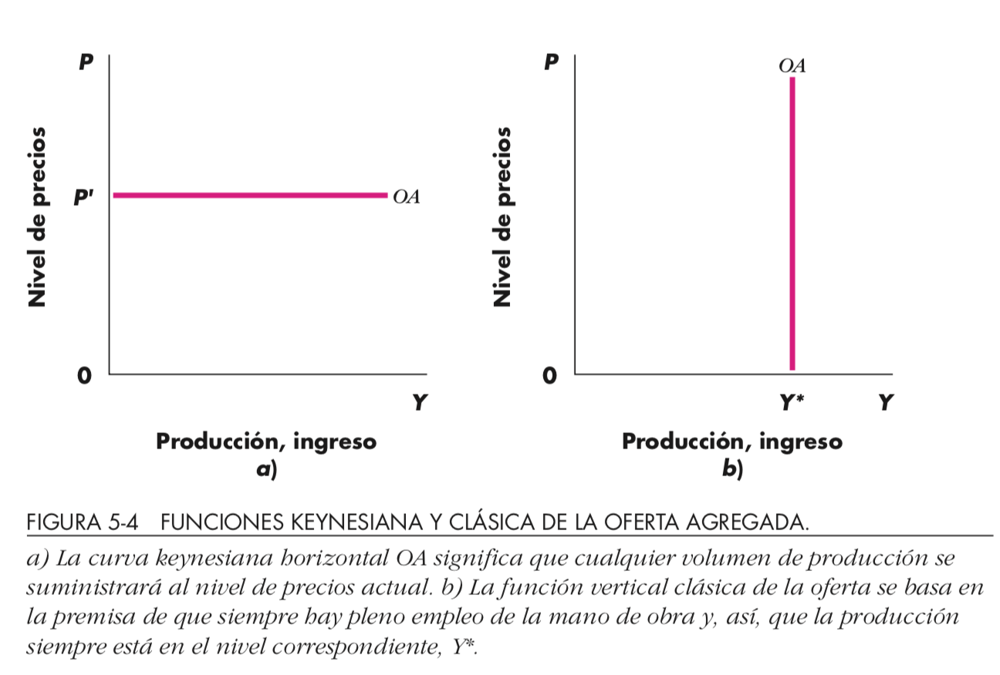
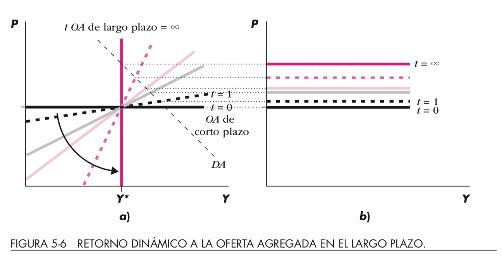

# Clase 11 - Demanda Agregada

- Pendientes: Modelo OA-DA
- Quién demanda?
- Desglose ecuación (repaso) $Y=C+I+G+XN$
    - Definiciones con precisión
    - Consideraciones
- Sectores: privado, público y externo
- Casos
    - Cerrado y privado
    - Cerrado y público
    - Con y sin sector externo
    
Dornbush et ali 2.2-2.3, 9.1-9.2  
Próximos: Dornbush et ali 9.1-9.3

---

# Modelo OA-DA

- (OA): para cada nivel de precios el monto de producción que las empresas están dispuestas a ofrecer
    - pendiente positiva porque las empresas están dispuestas a abastecer más producción a mayor precio
- (DA): nivel de precios y el nivel de producción en el que los mercados de bienes y de dinero están en equilibrio simultáneamente
    - pendiente negativa 
        - precios altos reducen el valor de la oferta monetaria
        - aminora la demanda de productos

---

{height=70%}\

---

{height=70%}\

---

{height=70%}\

---

# Oferta Agregada D5.1

{height=70%}\

---

# Oferta Agregada y mecanismo de precios D5.2

{height=70%}\

---

# Demanda Agregada

$$P_{t+1}=P_t[1+\lambda(Y-Y^*)]$$

---

# Quién demanda ?

|Quién|Canal|Qué|
|---|---|---|
|Hogares|Consumo|Bienes y Servicios|
| |Ahorro|Mercado Financiero|
|Gobierno|Impuestos||
|Empresas|Inversión|Bienes y Servicios|

$$DA=\underbrace{C}_{\text{Hogares}}+\underbrace{I}_{\text{Empresas}}+\underbrace{G}_{\text{Gobierno}}+\underbrace{XN}_{\text{Resto del mundo}}$$

---

# Tópicos discusión

- Sindicatos (ver slides extra)
    - importancia técnica económica pero también social
    - grupos negociadores
    - sistemas de bienestar
    - tasas de sindicalización
    - no demonizar los sindicatos 
        - aliados para la innovación
- Flexibilidad laboral 
    - importancia para la eficiencia
    - FPP
    - Precarización laboral
    - desempleo juvenil, por cuenta propia, de las mediciones, etc. 
    

---

# Tópicos discusión 2

- Comisión Sarkozy 
- Comitiva con los reyes y empresarios noruegos: 
    - estándar medioambiental
    - crecimiento, sostenibilidad: 
        - Calidad del crecimiento (Solimano)
- Mecanismos de depreciación 
- PIB sectores transables y no transables (competencia internacional)

