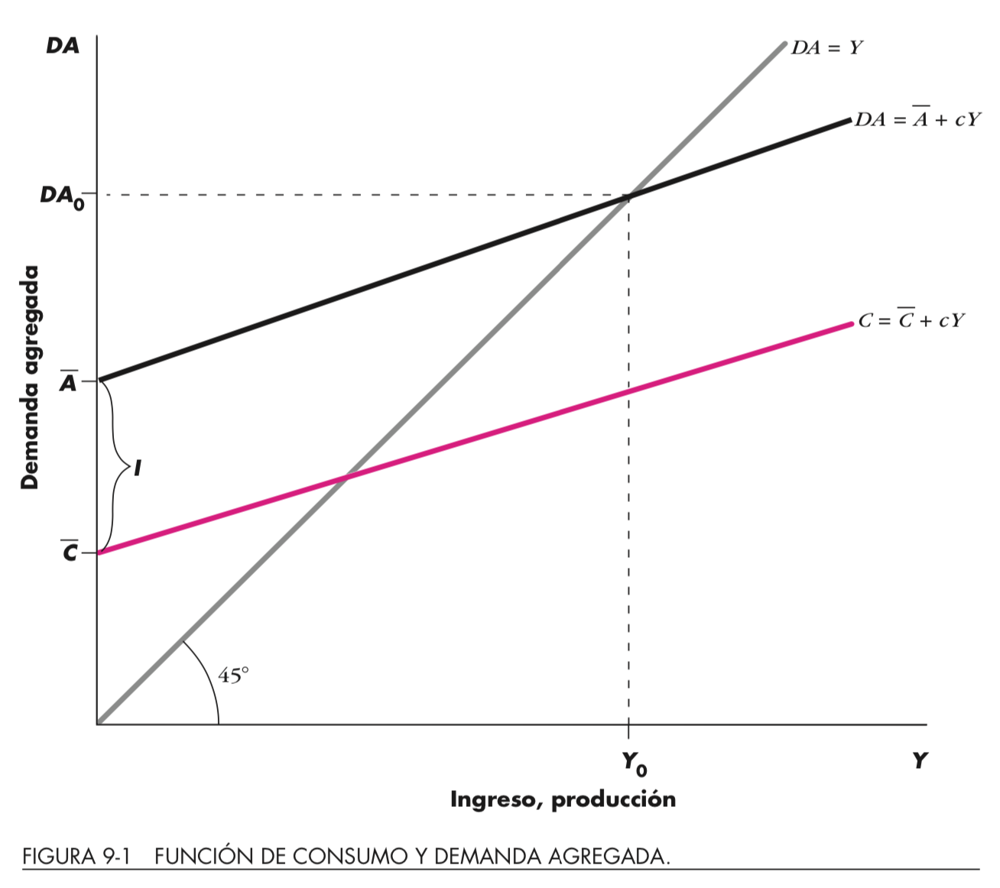
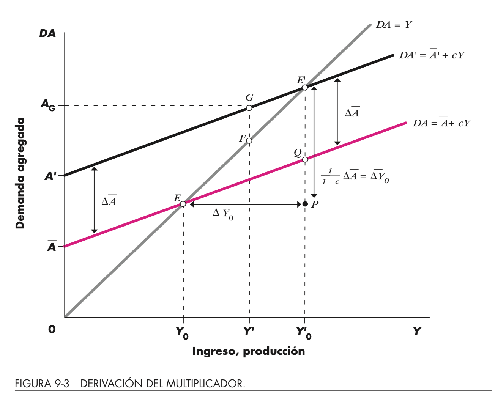

Clase 14-15
========================================================
author: F. Cabrera, S. Cea
date: Abril 2019
autosize: true

Clase 14
========================================================

- Repaso Multiplicadores
- Curva de Phillips
- Construcción IS
  - Inversión y tasa de interés
  - Construcción
  - Análisis Política Fiscal: Expansiva/Restrictiva/Financiada

***

Lecturas:  
- Dornbush et ali 
  - Cap 2.7 (tasa de interés), 
  - 10.1 (curva IS) 
  - 11.2 (pol. fiscal)

Consumo y DA
========================================================

Sean $\overline{C}>0,\quad c\in(0,1)$,  
$$C(Y)=\underbrace{\overline{C}}_\text{Consumo Autónomo}+\underbrace{c}_\text{Propensión Marginal Consumo}Y$$  

Consumo y DA
========================================================

***

Sistema Cerrado y Privado (Sin Gobierno)  

- $DA=C(Y)+I$ 
- $OA=Y$  
- Equilibrio: $Y=C(Y)+I$

Ahorro
=======================
$S\equiv  Y-C(Y)=Y-\overline{C}+cY\Rightarrow S=-\overline{C}+(1-c)Y$  

**

- Ahorro como inventarios (IU): $S=\underbrace{I_p}_\text{Previsto}+\underbrace{I_{np}}_\text{No Previsto}$  
- Ahorro equivale a la inversión 
  - (caso sin Gobierno ni sector externo)
  
Sector Público y Externo
=============================
- $G$  

$$DA=C+I+\underbrace{G}_{TA=T-TR}$$

$$T=\underbrace{T_0}_\text{autónomo}+\underbrace{t}_\text{tasa impositiva}\cdot Y$$

- Modelo completo

\begin{eqnarray}
DA&=&C+I+G+XN\\
&=&C_0+c\cdot(Y-TA+TR)+I+G+NX\\
&=&\underbrace{\left[C_0-c\cdot(TA-TR)+I+G+NX\right]}_A+c\cdot Y
\end{eqnarray}

Multiplicador
==============

Tenemos $Y=A+c\cdot Y$, o de una forma equivalente

$$Y_0=\underbrace{\left(\frac{1}{1-c}\right)}_\text{multiplicador}A$$

***

Curva de Phillips
===================
Sea $w_t$ el precio de los salarios en el periodo $t$, tenemos $g_w=\frac{w_{t+1}-w_t}{w_t}$ y la relación llamada curva de Phillips $$g_w=-\underbrace{\epsilon}_\text{Tasa de ajuste}(\underbrace{u}_\text{Desempleo}-\underbrace{u^*}_\text{Desempleo Natural})$$

Si incluímos el rol de las expectativas tenemos el siguiente modelo actualizado

$$g_w-\pi^e=-\underbrace{\epsilon}_\text{Tasa de ajuste}(\underbrace{u}_\text{Desempleo}-\underbrace{u^*}_\text{Desempleo Natural})$$

===================
{height=70%}\
