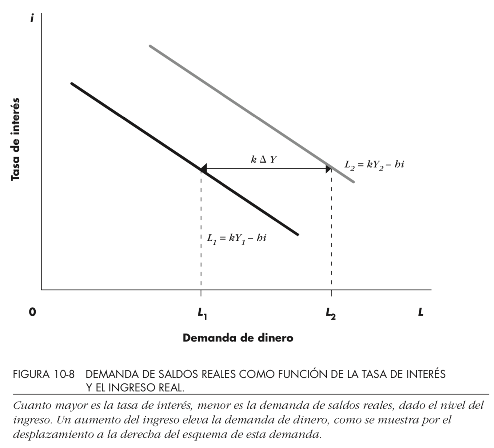

# Clase 14-16

|Clase14        |Clase 15        |Clase16            |
|---------------|----------------|-------------------|
|Construcción IS|LM              |Demanda Monetaria  |
||||
|(I,i)          |Sist. Financiero|Definición         |
|Política Fisal |Def. Dinero     |(i,Y)              |
|Exp/Cont       |Funciones Dinero|Motivos demanda    |
|Financiada     |                |Especulación       |
|               |                |Preferencias por L |
|               |                |Ecuación Dda dinero|
||||
|Lecturas|
||||
|2.7, 10.1-10.5,11.2|10.1-10.5 (15)|idem|

# Clase 15

- Rezagado clase 14: 
  - Política Fiscal Financiada y 
  - Ejemplo numérico
- Sistema Financiero
- Definición Dinero
- Funciones del Dinero

### Lecturas:  
- Dornbush et ali 
  - 10.1 (curva IS) 
  - 10.2 (mcdo dinero y LM)
  - 10.3 (equilibrio mcdos bienes y dinero)
  - 10.4 (DA como equilibrio IS-LM)
  - 10.5 (Tratamiento formal)
  
# Política Fiscal

- Repaso IS (Clase 14)
- Contractiva - Expansiva - Financiada
- Relación con el ciclo económico: (contra) cíclico
- Dependencia del legislativo
- Efectos en inversión/inflación/deuda

# Sistema Financiero

- Activos: 
  - Ejemplos: Préstamos, obligaciones, bonos, acciones
  - Características: Rentabilidad, condiciones, mercados (disponibilidad)
- Funciones sistema
  - Liquidez (como todo mercado)
  - Riesgo/Fricciones (Hipótesis eficiencia)
- Intermediarios: Fondos inversión o pensiones, aseguradoras, bancos
- Comportamientos: Manada, Burbujas, Algoritmos

# Dinero

- Definición: medio de cambio
  - transacciones
  - unidad de cuenta
  - depósito valor
  - patrón pago diferido
- Demanda: Nominal versus Real
- Mercado de dinero <=> Bonos
- Ilusión monetaria
- Características: Fiduciario, divisible, duradero, limitado (oferta), transportable, homogéneo

# Agregados monetarios

- Definiciones Banco Central de Chile
- Apartado 15.1 Dornbush et ali

M1: Billetes y monedas + depósitos a la vista  
M2: M1 + Depósitos a plazo  
M3: M2 + Depósitos de ahorro a plazo

# Clase 16: Demanda Monetaria

- Definición
- (i,Y)
- Motivos demanda
- Especulación
- Preferencias por liquidez
- Ecuación dda dinero

# Demanda por dinero

- Definición: El promedio de dinero que se maneja de manera corriente en un periodo de tiempo
- Motivos demanda
  - Transacción
  - Precaución
  - Especulación

# Demanda saldos reales

::: columns

:::: column

{height=70%}\

::::

:::: column

\begin{eqnarray*}
L&=&\text{Dda Saldos Reales}\\
&=&k\cdot Y-h\cdot i,\quad k,h>0
\end{eqnarray*}

::::

:::

# Repaso con preguntas

- Preguntas
  - Aumento multiplicador => Pendiente DA/IS?

