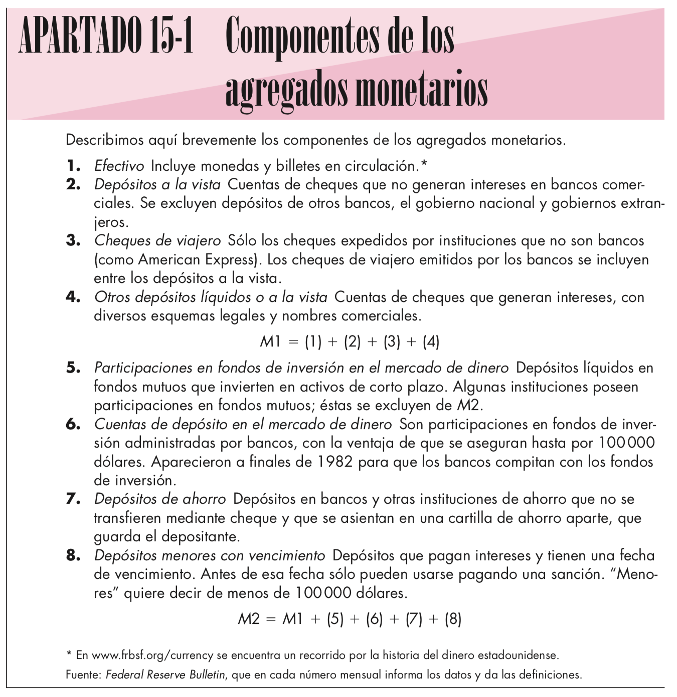
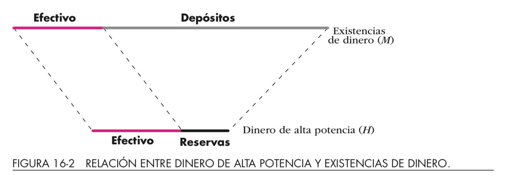

# Clase 17

- Oferta Monetaria: 
  - Qué es?
  - Banco Central: institución, su función y objetivo
- Bancos Comerciales
  - Quién ofrece dinero? Multiplicador Bancario
- Distintos tipos de tasas 
 - captación
 - colocación 
 - interbancaria
 
 Lecturas Dornbush et ali: 10.1-10.5 y 16*
 
# Oferta monetaria

::: columns

:::: column

- Competencia: 
  - más o menos bancos
  - más o menos productos relacionados (integración vertical)
  
- Agregados monetarios
  - [Definiciones Banco Central de Chile](https://si3.bcentral.cl/estadisticas/Principal1/Metodologias/EMF/AGREGADOS_MONETARIOS/Base_Monetaria.pdf)

::::

:::: column

{height=70%}\

::::

:::

---

|Agregado|Descripción|Liquidez|
|---|------------------------------------------|--|
|M1| Billetes y monedas + depósitos a la vista|Mayor|
|M2| M1 + Depósitos a plazo|Intermedia|
|M3| M2 + Depósitos de ahorro a plazo|Menor|

# Banco Central

- Objetivo: Estabilidad del sistema de pagos / preservar valor moneda
- Funciones:
  - Emisión primaria
  - Banco de bancos
- Herramienta(s): Política Monetaria
  - Tasa encaje
  - Tasa redescuento
  - Operaciones de mercado abierto
  
|Tipo Política|Tasa encaje|Tasa redescuento|Operaciones|
|-------------|-----------|----------------|-----------|
|Expansiva|$(-)$|$(-)$|Compra|
|Restrictiva|$(+)$|$(+)$|Vende|

# Banco Comerciales

- Deben encajar el 10% de los depósitos por seguridad
- Emisión secundaria: crean dinero al intermediar (captación/colocación)
  - Tasa captación: interés depósito
  - Tasa colocación: interés crédito
  $$\text{Tasa captación}<\text{Spread Bancario}<\text{Tasa colocación}$$
- Tasa interbancaria
- Criterios funcionamiento:
  - Liquidez
  - Solvencia
  - Rentabilidad
  
---

$$CU+D=M$$

{height=70%}\

$$CU+\text{reservas}=H$$

Multiplicador Monetario: $\frac{M}{H}$

# Revisión Ejercicio

Con qué fin el Gobierno Chino otorga financiamiento al exterior? Base su respuesta en el modelo de DA

- China busca ser la potencia mundial sobre las energías “verdes”, china por su lado tiene la opción de invertir en arg y así poder obtener un retorno sobre este y una mayor demanda agregada.
- Aumentar M en la demanda para aumentar esta en su totalidad.
- Para argentina y china hay un cambio en su sector externo, no logro ver cual aumenta y cual disminuye, solo con percepcion diria que china busca qmpliar la capacidad de compra de los paises que demandan sus bienes y por esto trata de impulsarlos
- El incentivo del Gobierno Chino seria el de aumentar la capacidad de demanda del pais al que le otorgan financiamiento. El financiamiento se ve reflejado en la M del modelo de DA.
- Aumentar la cantidad de dinero (M) en Argentina, tiene como objetivo desplazar la DA en China, y al aumentar el nivel de precios la producción crecerá

---

Con qué fin el Gobierno Chino otorga financiamiento al exterior? Base su respuesta en el modelo de DA

- Modo de inversion y ayuda a los paises que le producen las materias primas
- Por una parte buscaría saldar el déficit comercial que tendría con Argentina al importar más que exportar, destinando inversión para compensar el déficit.
- El gobierno chino otorga financiamiento debido a que la mano de obra, impuesto son más accesible y le permite obtener un mayor ahorro del que se obtendría si se realizara en el pais.
- El fin es aumentar la presencia global de china, y aumenta su demanda agregada, ya que aumenta su M (cantidad de dinero)

# Repaso con preguntas

- Aumento multiplicador => Pendiente DA/IS?

# Clase 18
 
- Construcción de la curva LM
- Políticas de estabilización 
- Política Monetaria: 
  - Instrumentos (Tasas de encaje, redescuento, etc)
  - Bancos comerciales
- Tasas interbancarias. Funcionamiento sobre el nivel de tasas del Central y entre los bcos comerciales 
- Ecuación en el Mercado monetario: LM Traslados por políticas monetarias

