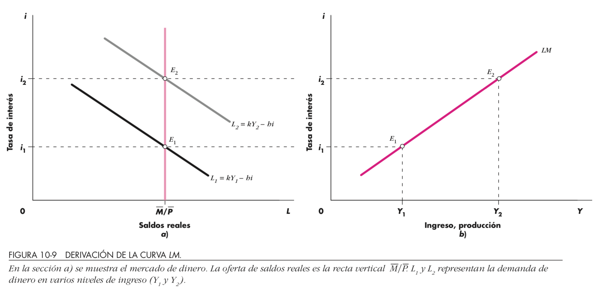
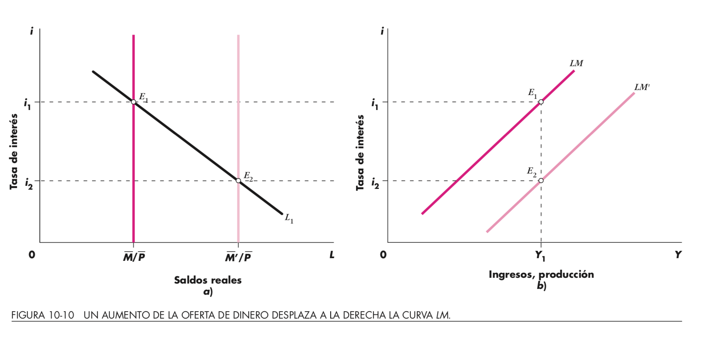
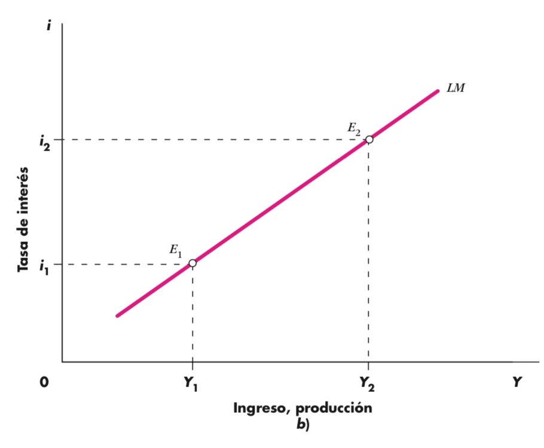
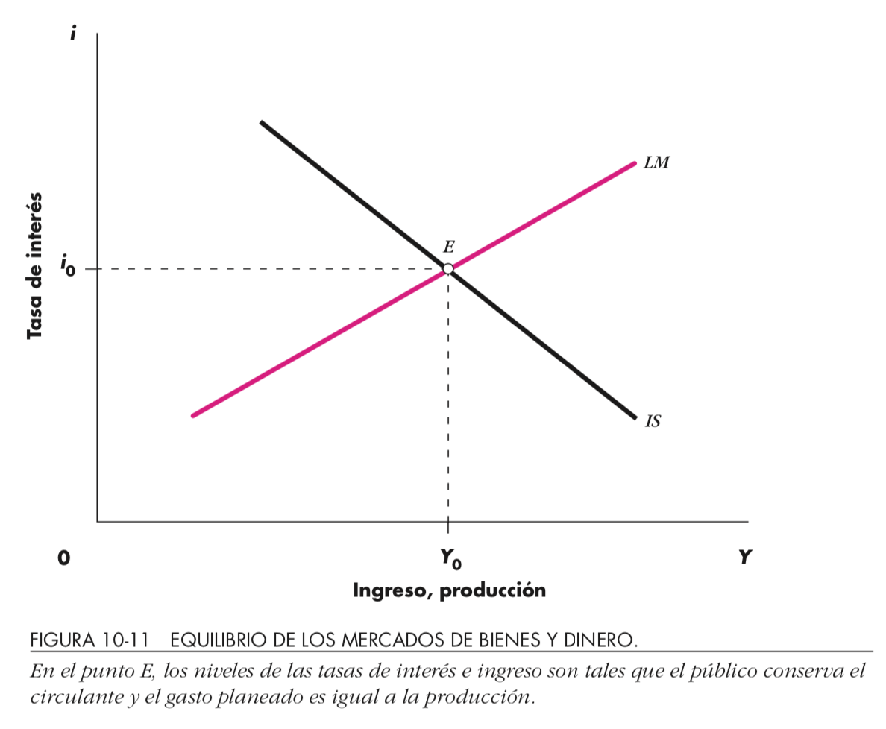
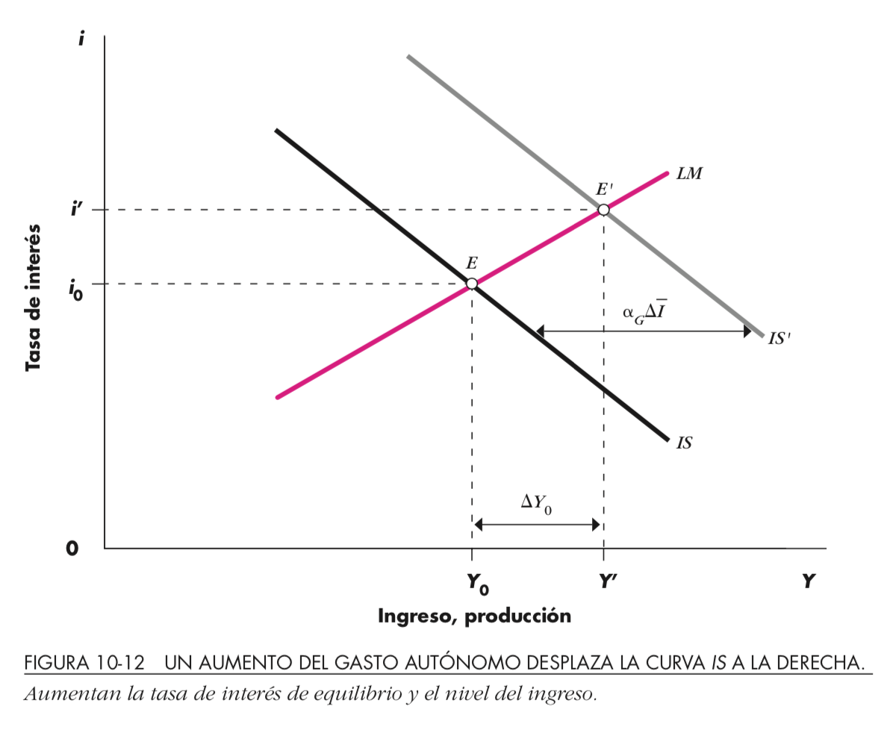

# Clase 17

- Oferta Monetaria: 
  - Qué es?
  - Banco Central: institución, su función y objetivo
- Bancos Comerciales
  - Quién ofrece dinero? Multiplicador Bancario
- Distintos tipos de tasas 
 - captación / colocación / interbancaria
- Políticas de estabilización 
- Política Monetaria: 
  - Instrumentos (Tasas de encaje, redescuento, etc)
  - Bancos comerciales
- Tasas interbancarias
  - Respecto tasas del Central
  - Entre los bcos comerciales
 
 Lecturas Dornbush et ali: 10.1-10.5 y 16*
 
# Oferta monetaria

::: columns

:::: column

- Competencia: 
  - más o menos bancos
  - más o menos productos relacionados (integración vertical)
  
- Agregados monetarios
  - [Definiciones Banco Central de Chile](https://si3.bcentral.cl/estadisticas/Principal1/Metodologias/EMF/AGREGADOS_MONETARIOS/Base_Monetaria.pdf)

::::

:::: column

{height=70%}\

::::

:::

---

|Agregado|Descripción|Liquidez|
|---|------------------------------------------|--|
|M1| Billetes y monedas + depósitos a la vista|Mayor|
|M2| M1 + Depósitos a plazo|Intermedia|
|M3| M2 + Depósitos de ahorro a plazo|Menor|

# Banco Central

- Objetivo: Estabilidad del sistema de pagos / preservar valor moneda
- Funciones:
  - Emisión primaria
  - Banco de bancos
- Herramienta(s): Política Monetaria
  - Tasa encaje
  - Tasa redescuento
  - Operaciones de mercado abierto
  
|Tipo Política|Tasa encaje|Tasa redescuento|Operaciones|
|-------------|-----------|----------------|-----------|
|Expansiva|$(-)$|$(-)$|Compra|
|Restrictiva|$(+)$|$(+)$|Vende|

# Banco Comerciales

- Deben encajar el 10% de los depósitos por seguridad
- Emisión secundaria: crean dinero al intermediar (captación/colocación)
  - Tasa captación: interés depósito
  - Tasa colocación: interés crédito
  $$\text{Tasa captación}<\text{Spread Bancario}<\text{Tasa colocación}$$
- Tasa interbancaria
- Criterios funcionamiento:
  - Liquidez
  - Solvencia
  - Rentabilidad
  
---

$$CU+D=M$$

{height=70%}\

$$CU+\text{reservas}=H$$

Multiplicador Monetario: $\frac{M}{H}$

# Clase 18
 
- Construcción de la curva LM
- Ecuación en el Mercado monetario: LM Traslados por políticas monetarias
- Políticas de estabilización 
- Política Monetaria

# Construcción LM

{height=70%}\

# Variación en Oferta Monetaria

{height=70%}\

- ¿Figura representa política monetaria expansiva o restrictiva?

# Excesos de Oferta/Demanda Monetaria

::: columns

:::: column

{height=70%}\

::::

:::: column

- ¿Dónde situar?
  - EOM
  - EDM
- Comparar gráfico anterior

$\,$

{height=20%}\
::::

:::

# Equilibrio ISLM

::: columns

:::: column

{height=70%}\

::::

:::: column

{height=70%}\

::::

:::

- En equilibrio, ¿Cuál es el impacto de los excesos de:?
  - Oferta/Demanda Monetaria
  - Oferta/Demanda Agregada

# Clase 19

- Análisis de casos:
  - Exceso de Oferta / Demanda Agregada / Monetaria  (EDA, EOA, EDM, EOM) 
- Política Fiscal Expansiva:
 - Efecto Crowding Out
- Política Monetaria Expansiva:
  - Mecanismos de Transmisión
- Casos extremos clásicos y keynesianos

Lecturas Dornbush et ali: 11.1-11.4  
Noticias?

# Revisión Ejercicio

¿Con qué fin el Gobierno Chino otorga financiamiento al exterior? Base su respuesta en el modelo de DA

- China busca ser la potencia mundial sobre las energías “verdes”, china por su lado tiene la opción de invertir en arg y así poder obtener un retorno sobre este y una mayor demanda agregada.
- Aumentar M en la demanda para aumentar esta en su totalidad.
- Para argentina y china hay un cambio en su sector externo, no logro ver cual aumenta y cual disminuye, solo con percepcion diria que china busca qmpliar la capacidad de compra de los paises que demandan sus bienes y por esto trata de impulsarlos
- El incentivo del Gobierno Chino seria el de aumentar la capacidad de demanda del pais al que le otorgan financiamiento. El financiamiento se ve reflejado en la M del modelo de DA.

---

¿Con qué fin el Gobierno Chino otorga financiamiento al exterior? Base su respuesta en el modelo de DA

- Aumentar la cantidad de dinero (M) en Argentina, tiene como objetivo desplazar la DA en China, y al aumentar el nivel de precios la producción crecerá
- Modo de inversion y ayuda a los paises que le producen las materias primas
- Por una parte buscaría saldar el déficit comercial que tendría con Argentina al importar más que exportar, destinando inversión para compensar el déficit.
- El gobierno chino otorga financiamiento debido a que la mano de obra, impuesto son más accesible y le permite obtener un mayor ahorro del que se obtendría si se realizara en el pais.
- El fin es aumentar la presencia global de china, y aumenta su demanda agregada, ya que aumenta su M (cantidad de dinero)

# Repaso con preguntas

- Aumento multiplicador => Pendiente DA/IS?
- Ejercicio Tarea:
  - Familias 
    - consumirían un monto de $3.000$ si no tuvieran ingresos 
    - por cada $100$ pesos que reciben, destinan $20$ al ahorro
  - Los desembolsos del gobierno fueron de 
    - $50.000$ en remuneraciones, 
    - $20.000$ en gastos corrientes y 
    - $3.000$ de transferencias a las familias en situación de riesgo social
    - Los ingresos de dicho gobierno provinieron de impuestos fijos por $2.000, más una tasa impositiva del 10% a los ingresos de las personas.
  - Empresarios invierten de acuerdo a la siguiente función $80.000-500i$
  - Se sabe además que la demanda monetaria está representada por: 	$L= 0,5Y-500i$ y los saldos reales ascienden a $274.600$
  
  Determine: $C_0, c, G, TR, TA, t, I, L, \frac{M}{P}$

