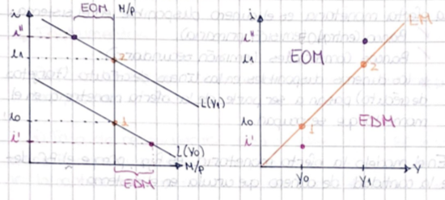
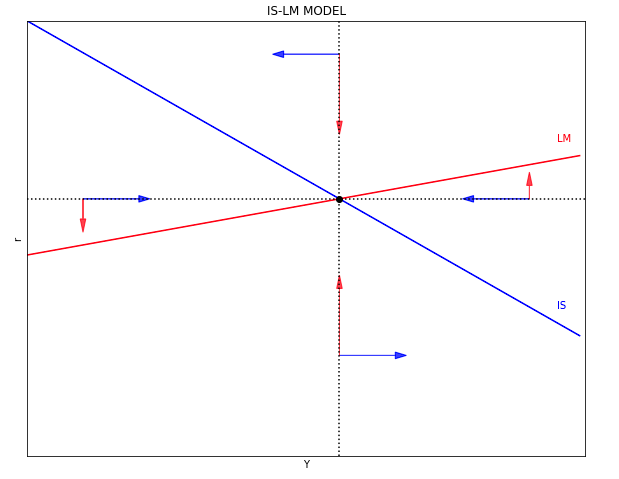
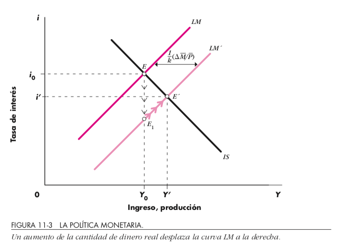
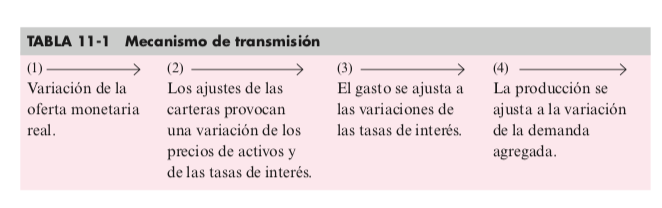
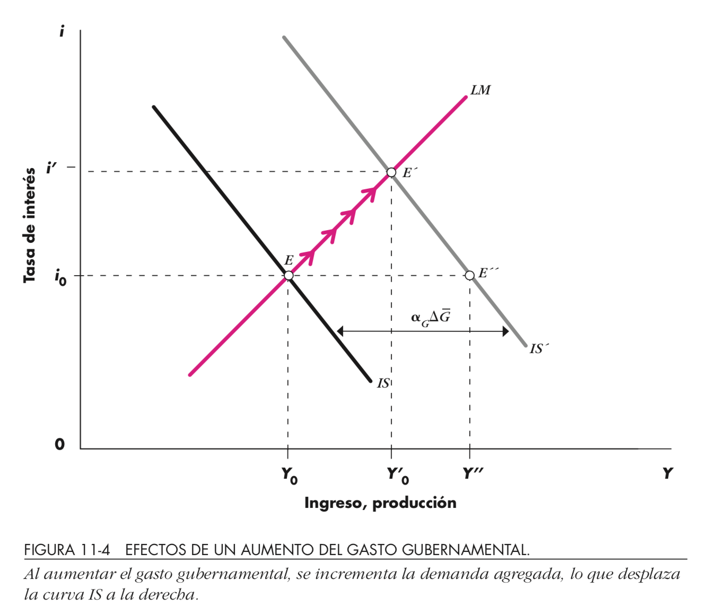
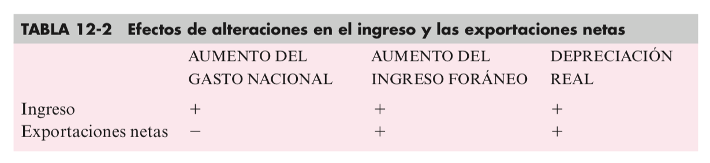
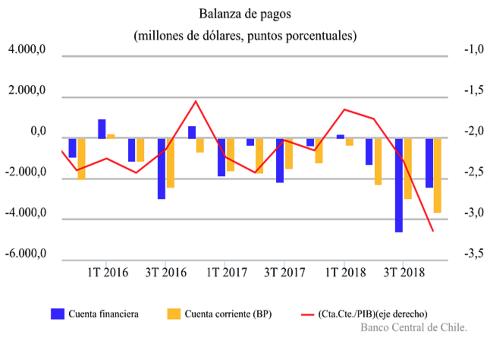

# Revisión Ejercicio

¿Con qué fin el Gobierno Chino otorga financiamiento al exterior? Base su respuesta en el modelo de DA

- China busca ser la potencia mundial sobre las energías “verdes”, china por su lado tiene la opción de invertir en arg y así poder obtener un retorno sobre este y una mayor demanda agregada.
- Aumentar M en la demanda para aumentar esta en su totalidad.
- Para argentina y china hay un cambio en su sector externo, no logro ver cual aumenta y cual disminuye, solo con percepcion diria que china busca qmpliar la capacidad de compra de los paises que demandan sus bienes y por esto trata de impulsarlos
- El incentivo del Gobierno Chino seria el de aumentar la capacidad de demanda del pais al que le otorgan financiamiento. El financiamiento se ve reflejado en la M del modelo de DA.

---

¿Con qué fin el Gobierno Chino otorga financiamiento al exterior? Base su respuesta en el modelo de DA

- Aumentar la cantidad de dinero (M) en Argentina, tiene como objetivo desplazar la DA en China, y al aumentar el nivel de precios la producción crecerá
- Modo de inversion y ayuda a los paises que le producen las materias primas
- Por una parte buscaría saldar el déficit comercial que tendría con Argentina al importar más que exportar, destinando inversión para compensar el déficit.
- El gobierno chino otorga financiamiento debido a que la mano de obra, impuesto son más accesible y le permite obtener un mayor ahorro del que se obtendría si se realizara en el pais.
- El fin es aumentar la presencia global de china, y aumenta su demanda agregada, ya que aumenta su M (cantidad de dinero)

# Repaso con preguntas

- Ejercicio Tarea:
    - Familias 
      - consumirían un monto de $3.000$ si no tuvieran ingresos 
      - por cada $100$ pesos que reciben, destinan $20$ al ahorro
  - Los desembolsos del gobierno fueron de 
    - $50.000$ en remuneraciones, 
    - $20.000$ en gastos corrientes y 
    - $3.000$ de transferencias a las familias en situación de riesgo social
    - Los ingresos de dicho gobierno provinieron de impuestos fijos por $2.000, más una tasa impositiva del 10% a los ingresos de las personas.
  - Empresarios invierten de acuerdo a la siguiente función $80.000-500i$
  - Se sabe además que la demanda monetaria está representada por: 	$L= 0,5Y-500i$ y los saldos reales ascienden a $274.600$
  
  Determine: $C_0, c, G, TR, TA, t, I, L, \frac{M}{P}$
  
---

$$\left(C_0, c, G, TR, TA, t, I, L, \frac{M}{P}\right)$$
$$=$$
$$(3000,0.8,70000,3000,2000,0.1,80000-500i,0.5Y-500i,274600)$$

- Calcule $DA$
- Derive curva $IS$
- Derive curva $LM$
- Encuentre tasa interés equilibrio ($3.076$)
  
  

# Clase 19

- Análisis de casos:
  - Exceso de Oferta / Demanda Agregada / Monetaria  (EDA, EOA, EDM, EOM) 
- Política Monetaria Expansiva:
  - Mecanismos de Transmisión  
- Política Fiscal Expansiva:
 - Efecto Crowding Out
- Casos extremos clásicos y keynesianos

Lecturas Dornbush et ali: 11.1-11.4  

# Excesos de Oferta/Demanda Monetaria

{height=70%}\

# Equilibrio ISLM

{height=70%}\

# Mecanismos de transmisión

::: columns

:::: column

- Compra bonos Banco Central
- Desplazamiento LM (derecha)
- Disminuye tasa interés
- Aumenta el ingreso
  - Debido a más inversión (por interés más bajo)

::::

:::: column

{height=70%}\

::::

:::

{height=70%}\

# Ejercicios

- Pol. Monetaria Expansiva (PME): $$\Delta^+\left(\frac{M}{P}\right)\Rightarrow\Delta^- i\Rightarrow\Delta^+I\Rightarrow\Delta^+DA\Rightarrow\Delta^+Y$$
  - Overshooting de $i$ 
- Pol. Fiscal Expansiva (PFE)
- Aumento multiplicador => Pendiente DA/IS?

# Casos notables (extremos)

::: columns

:::: column

Clásico

- LM vertical
- $\Delta$IS no afecta producto
- Pol. Monetaria totalmente efectiva (en Y)
- Solo el dinero importa

::::

:::: column

Keynesiano

- LM horizontal
- $\Delta$IS afecta producto
- Pol. Fiscal más efectiva

::::

:::

# Expulsión (Crowding-out)

::: columns

:::: column

{height=70%}\

::::

:::: column

Pol. Fiscal expansiva eleva tasa interés relativo a

- Pendiente LM
- Pendiente IS
$$Y=\underbrace{\frac{1}{1-c\cdot(1-t)}}_{\alpha_G}(\overline{A}-b\cdot i)$$

::::

:::

# Clase 20: Balanza de Pagos

- Cuenta corriente
  - Componentes (balanza comercial, balanza de servicios, transferencias)
- Cuenta de capital:
  - Componentes (corto plazo, largo plazo)
- Mercado Cambiario:
  - Divisas (oferta y demanda)
  - Tipo de cambio (real y nominal)
- Términos de intercambio (diferencia)
- Conceptos importantes (depreciación, apreciación, devaluación, revaluación, tipo de cambio competitivo, síndrome holandés, guerra comercial)
- Variables relevantes que modifican el equilibrio del mercado cambiario (nivel de ingresos, nivel de precios y tasas de interés). $[Xn \rightarrow R;Y;Y^*]$

Lecturas Dornbush et ali: 12.1-12.4

# Conceptos

- Balanza de pagos: registro de las transacciones de los habitantes de un país con  el resto del mundo
  - Cuenta Corriente: registro comercio de bienes, servicios y pagos de transferencia
  - Cuenta de Capital: registro de compras y ventas de activos
    - Privadas
    - Reserva oficial: banco central
  
  $$\text{Cuenta Corriente}+\text{Cuenta de Capital}=0$$
  
# Balanza comercial

$$C+I+G=DS(i,Y)=\text{Gasto doméstico}$$

$$\underbrace{X(Y_f,R)}_\text{Exportaciones}-\underbrace{Q(Y,R)}_\text{Importaciones}=\underbrace{XN\left(Y,\underbrace{Y_f}_\text{Ingreso en el extranjero},\overbrace{R}^\text{Tipo cambio real}\right)}_\text{Exportaciones netas}$$

$$\text{Curva IS}: DS(i,Y)+XN(Y,Y_f,R)$$

{height=70%}\

---

{height=70%}\
[Fuente: Banco Central de Chile](https://www.bcentral.cl/balanza-de-pagos-y-posicion-de-inversion-internacional)

# Clase 21: Sistemas cambiarios

- Libre/fijo(unilateral)/flotación sucia

- Factores que determinan la elección 
  - tamaño o grado de apertura
  - credibilidad d elas instituciones
  - inflación, 
  - grado de flexibilidad del Mercado laboral 
  - nivel de reservas del BC
  - grado de desarrollo financiero

Lecturas Dornbush et ali: 12.1-12.2

# Conceptos

- Tipos de cambio
  - Fijo
  - Flexible
  - Flotación controlada (sucia)

# Clase 22: Mundell y Fleming

- inclusión de la balanza de pago
- Supuestos del modelo
- Prima por riesgo
- Políticas fiscales y monetarias en economía pequeña y abierta con tipo de cambio fijo y libre.
- Trinidad imposible

Lecturas Dornbush et ali: 12.5-12.6, 20*

