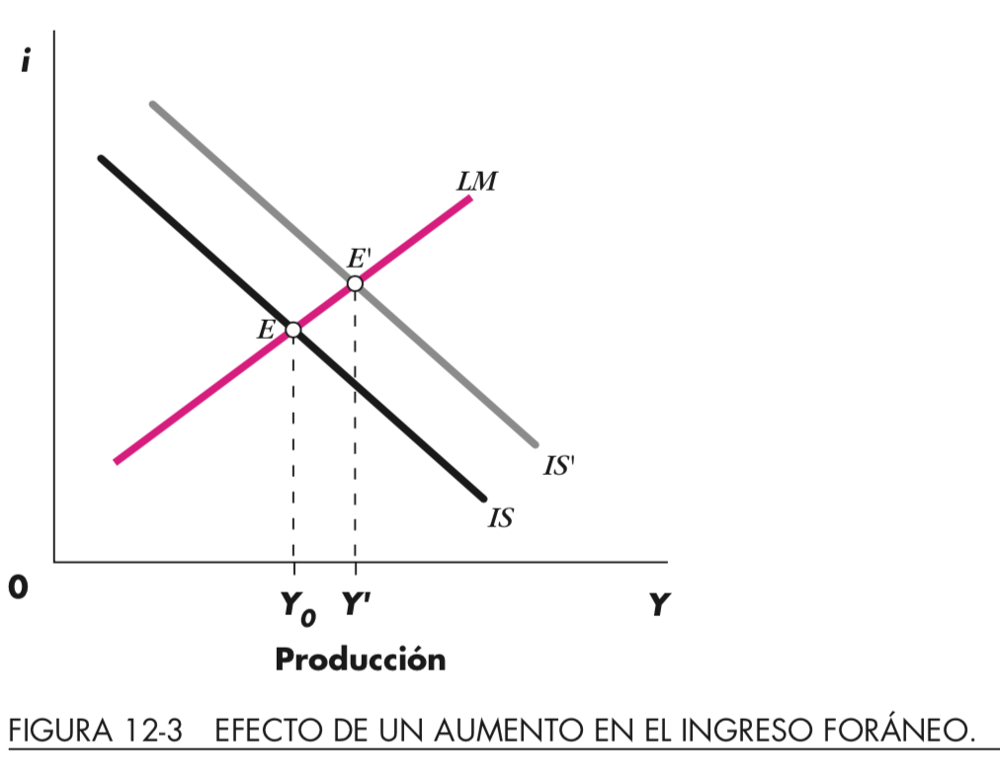
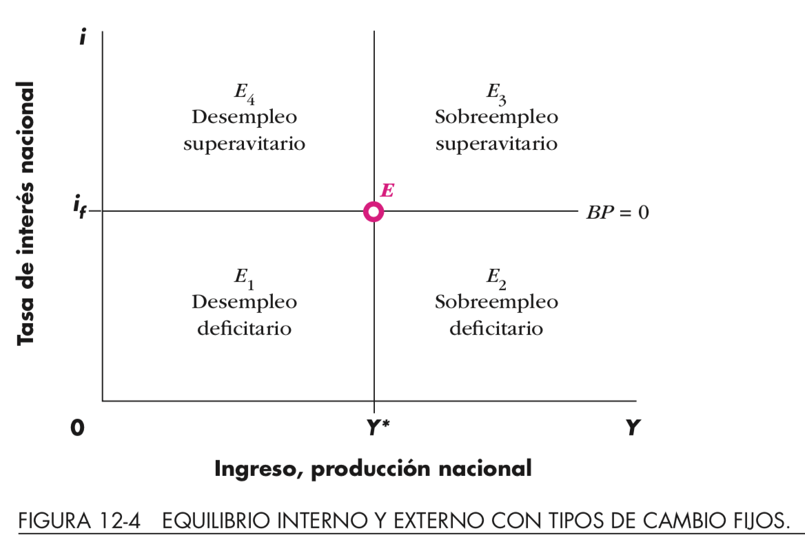
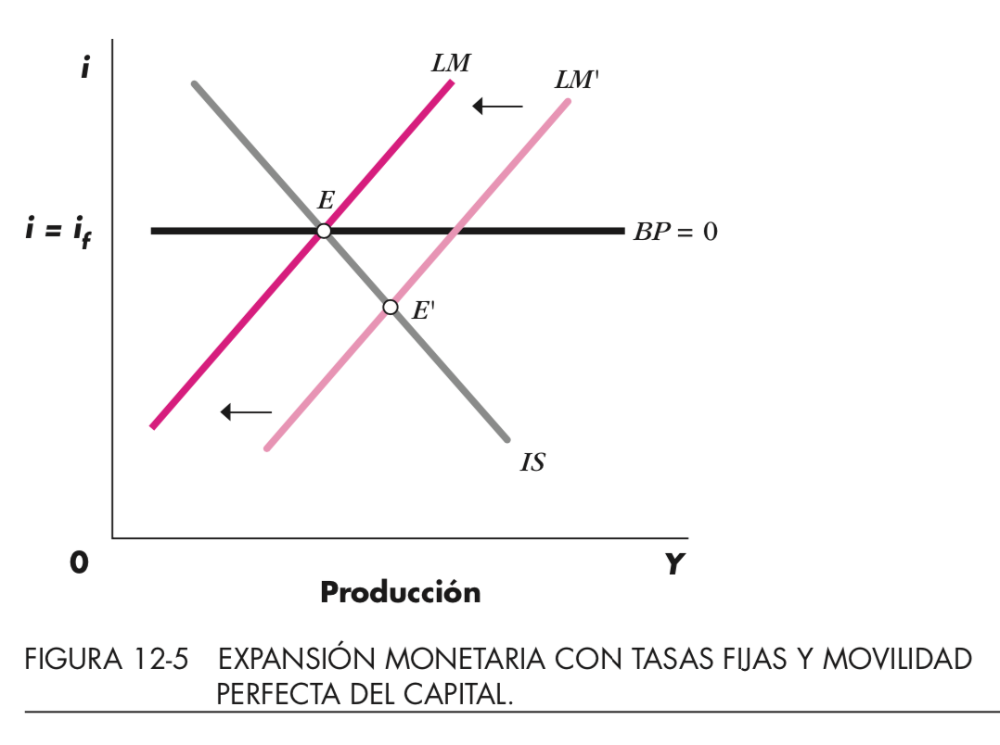
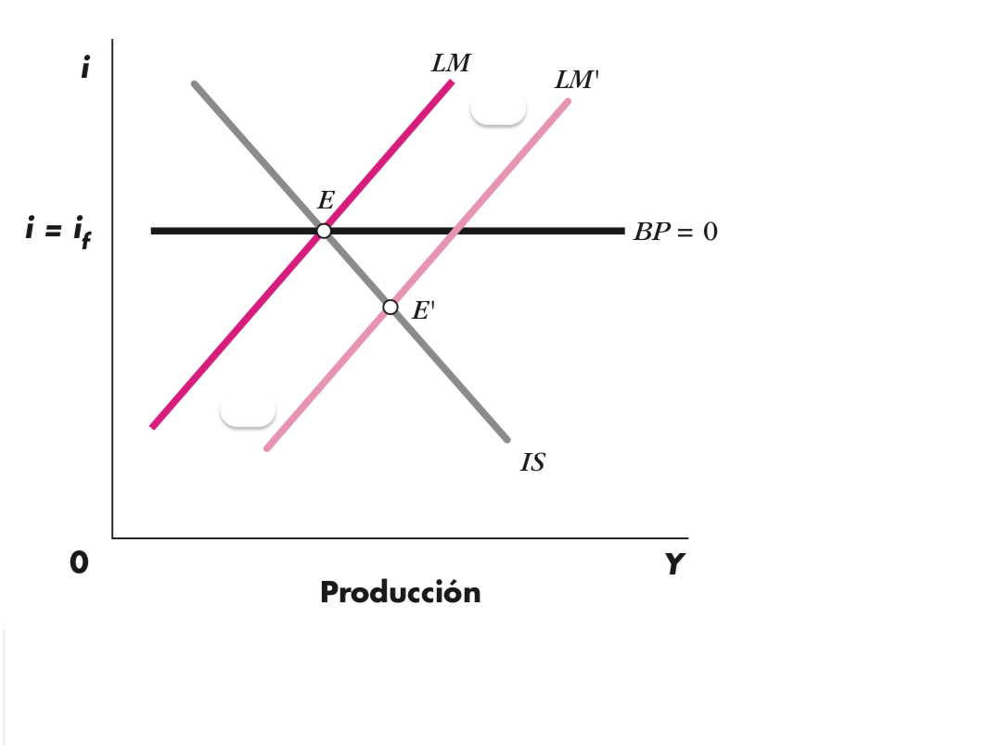
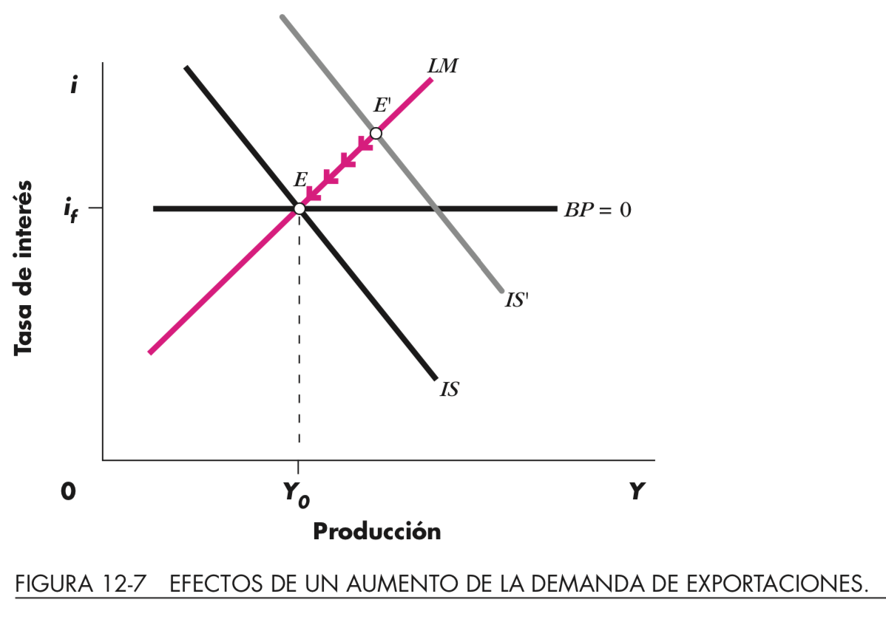
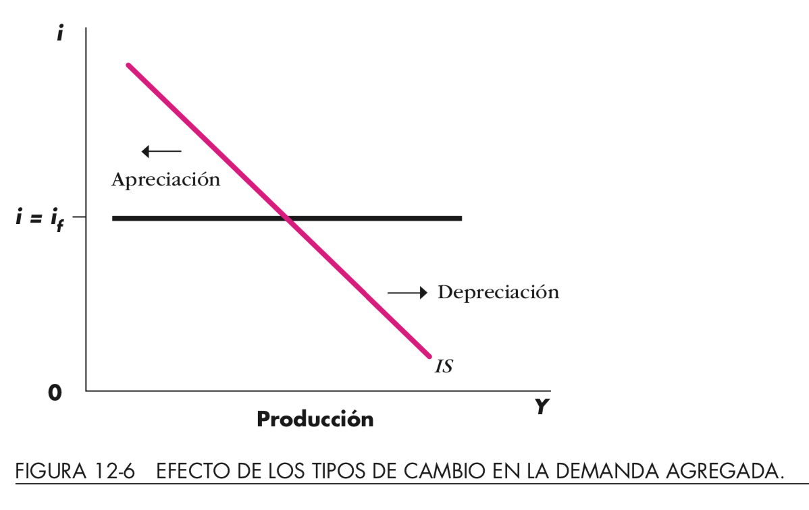
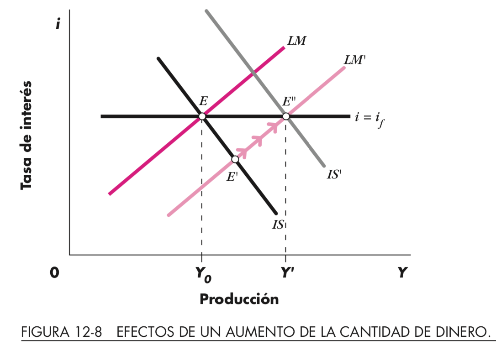

# Balanza de Pagos: repaso

- Cuenta Corriente
  - Balanza comercial: toda compra/venta (-/+) mercancías
  - Balanza servicios:
    - Financieros
    - No Financieros: turismo, transporte
  - Transferencias: ayudas/envíos (+/-)
- Cuenta Capital
  - Entrada (+): venta de activos al extranjero
  - Salida (-): compra de activos en el extranjero
  
# Ejercicio: Balanza pagos

::: columns

:::: column

De valores de balanza de pagos tales que la variación de reservas sea positiva (reservas disminuyen) y la cuenta corriente es deficitaria.

::::

:::: column

|Balanza|Monto|
|----|--------|
|Cta. Cta| |
|Cta. Capital||
|Err. y Omisiones||
|Saldo||
|$\Delta$ Reservas||

::::

:::

# Clase 21: Sistemas cambiarios

- Libre/fijo(unilateral)/flotación sucia

- Factores que determinan la elección 
  - tamaño o grado de apertura
  - credibilidad de las instituciones
  - inflación 
  - grado de flexibilidad del Mercado laboral 
  - nivel de reservas del BC
  - grado de desarrollo financiero

Lecturas Dornbush et ali: 12.1-12.2

# Conceptos

::: columns

:::: column

- Tipos de cambio
  - Fijo
  - Flexible
  - Flotación controlada (sucia)
  
::::

:::: column

$$\underbrace{R}_\text{Valor Moneda Extranjera}$$
$$=$$
$$\overbrace{e}^\text{tipo cambio nominal}\cdot\frac{\overbrace{P^*}^\text{precios externos}}{\underbrace{P}_\text{precios locales}}$$

::::

:::
  
  
# Variaciones Tipo de cambio: efectos

- Exportaciones

$$X(R,\underbrace{Y^*}_\text{Producto externo})$$

- Importaciones

$$I(R.Y)$$
  $$DA=C+I(i)+G+(X(R,Y^*)-I(R,Y))$$
  
- Tipo de cambio alto: fomenta o restringe exportaciones?
- Aumento ingreso externo/depreciación: mejora balanza comercial? Aumenta DA?
- Aumento ingreso nacional: aumenta importaciones? mejora balanza comercial?

---

{height=80%}\

---

# Ejercicios

- Derive la Demanda Agregada con una variación de precios en el modelo ISLM
- Aumentar el gasto público en $1.000$ de manera financiada con impuestos fijos
  - ¿Es el resultado coherente con lo esperado en el multiplicador del presupuesto equilibrado visto en clases? 

# Ejercicios resueltos

- Derivación Demanda Agregada
  - $\Delta^+P\Rightarrow\Delta^-\frac{M}{P}\Rightarrow\Delta^+i\Rightarrow\Delta^+Y$
- Ver Dornbush et ali p. 202-2010

$$Y=\frac{1}{1-c}\bar{A}\underbrace{\rightarrow}_\text{Inclusión impuesto proporcional}\frac{1}{1-c(1-t)}\bar{A}$$

# Clase 22: Mundell y Fleming

- inclusión de la balanza de pago
- Supuestos del modelo
- Prima por riesgo
- Políticas fiscales y monetarias en economía pequeña y abierta con tipo de cambio fijo y libre.
- Trinidad imposible

Lecturas Dornbush et ali: 12.5-12.6, 20*

# Balanza de pagos y movimientos de capital

$$BP=NX(Y,Y_f,R)+\underbrace{CF(i-i_f)}_\text{Superávit cuenta capital}$$
\vfill

- Equilibrio interno: producción en pleno empleo

- Equilibrio externo: balanza de pagos en equilibrio

# Equilibrio interno/externo

{height=80%}\

Menti

# Mundell-Fleming

$$XN(R,Y^*,Y)=X(\underbrace{R}_+,\underbrace{Y^*}_\text{+})-I(\underbrace{R}_-,\underbrace{Y}_+)$$

- Diferenciales tasa interés interna/externa $\Rightarrow$ Flujos capital
  - Supuesto: Movilidad (libre) capital
- Tipo cambio fijo: política monetaria dependiente del sector externo
  - Oferta monetaria dependiente de balanza de pagos (endógena)
  
# Expansión monetaria: tipo cambio fijo

{height=80%}\

$$\Delta M\Rightarrow\Delta BP\Rightarrow\Delta R\Rightarrow\Delta M$$

# Expansión Fiscal: cambio IS?

{height=80%}\

$$\Delta G\Rightarrow\Delta Y,i\Rightarrow\Delta R\Rightarrow\Delta M$$

# Aumento Exportaciones: tipo cambio flexible

{height=80%}\

# Tipo cambio flexible

::: columns

:::: column

- $i>i_f\Rightarrow \Delta R\Rightarrow\Delta DA$

- $i<i_f\Rightarrow \Delta R\Rightarrow\Delta DA$

::::

:::: column

{height=100%}\

::::

:::

# Política Monetaria: tipo de cambio flexible

{height=80%}\

# Varios

- Trinidad imposible: Política Monetaria/Cambiaria, Movilidad de capitales (menti)
- Politica anticomercial: efecto en IS?
  - Depreciación: exportar desempleo
- Consejos Prueba
- Encuesta Taller 3
