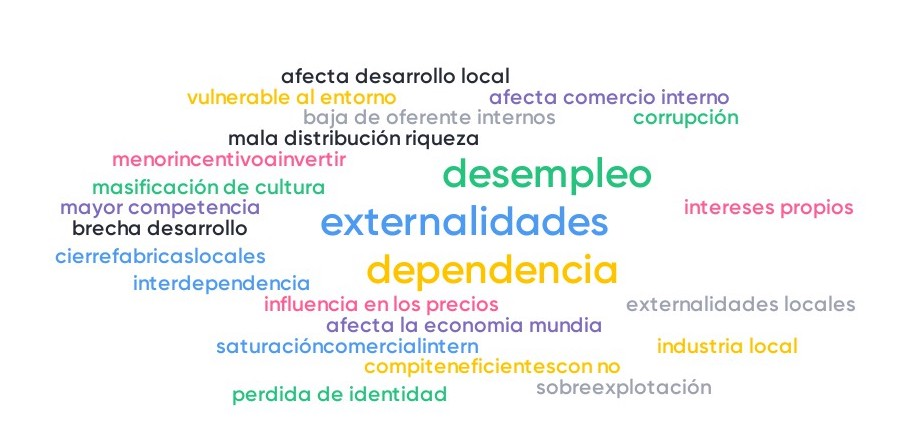

# Pendiente

- Trinidad imposible: Política Monetaria/Cambiaria, Movilidad de capitales (menti)
- Politica anticomercial: efecto en IS?
  - Depreciación: exportar desempleo
- Encuesta Taller 3

# Clase 23: Globalización desde el comercio

- Patrones de comercio
- Ccomercio internacional
- Cadenas Globales de valor (Relación con Geografía Económica)
- Diversificación

Lecturas Krugman: 1, 11 y 12

Próximas: 3, 4 y 5

# Evolución comercio

{height=80%}\

# Exportaciones chikenas

{height=80%}\

# Comercio 

$$\text{Comercio}\Leftrightarrow\text{Relaciones productivas/financieras/migratorias}$$

# 7 temas

- Ganancias comercio
- Patrones comercio
- Proteccionismo
- Balanza de pagos
- Tipo de cambio
- Coordinación políticas
- Mercados de capitales

# Política comercial y países emergentes

¿Por qué (no) proteger?

::: columns

:::: column

- Fallas de mercado: 
  - desarrollo mercado capitales 
  - apropiabilidad
  - externalidades: empleo, medioambiente

  
::::

:::: column 

- Sustitución de importaciones: industria naciente
- Comercio y crecimiento
- Rol de fomento del Estado: CORFO

::::

:::

{height=50%}\

# Política comercial y países emergentes
¿Por qué (no) proteger?

::: columns

:::: column

- Fallas de mercado: 
  - desarrollo mercado capitales 
  - apropiabilidad
  - externalidades: empleo, medioambiente

  
::::

:::: column 

- Sustitución de importaciones: industria naciente
- Comercio y crecimiento
- Rol de fomento del Estado: CORFO

::::

:::

{height=50%}\

# Chile

- Sustitución de importaciones de América latina
- Apertura unilateral 70s y 80s
- Acuerdos comerciales y bloques de asociación
- Diversificación de exportaciones y mercados destino

# Clase 24: Comercio Internacional

- Supuestos del modelo.
- Caso en Autarquía.
  - Precio relativo y ventaja comparativa.
- Caso con apertura al comercio internacional.
- Teoría neoclásica, modelo H-O-S:
  - Supuestos del modelo.
  - Eficiencia en la disponibilidad de recursos (H-O) inclusión de la remuneración de los factores productivos (S).
  - apertura y precio internacional.
  - Consecuencias en la cantidad ofertada y demandada del bien intensivo en el factor abundante y escaso.
  - ¿Cómo afecta al bienestar?
  - Consecuencias en la remuneración del FFPP abundante y escaso.
  - Convergencia y conclusiones.
  - Desigualdad y Catching-up. Ventajas comparativas y dinámicas. Dependencia de recursos naturales

Lecturas Krugman 3, 4, 5

