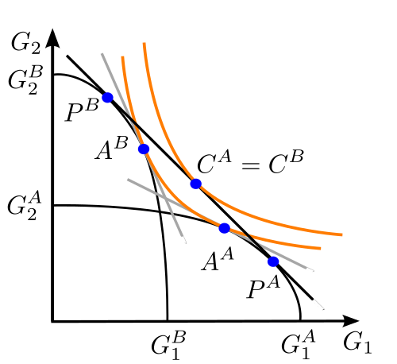

# Clase 25: Comercio Internacional

- Supuestos del modelo.
- Caso en Autarquía.
  - Precio relativo y ventaja comparativa.
- Caso con apertura al comercio internacional.
- Teoría neoclásica, modelo H-O-S:
  - Supuestos del modelo.
  - Eficiencia en la disponibilidad de recursos (H-O) inclusión de la remuneración de los factores productivos (S).
  - apertura y precio internacional.
  - Consecuencias en la cantidad ofertada y demandada del bien intensivo en el factor abundante y escaso.
  - ¿Cómo afecta al bienestar?
  - Consecuencias en la remuneración del FFPP abundante y escaso.
  - Convergencia y conclusiones.
  - Desigualdad y Catching-up. Ventajas comparativas y dinámicas. Dependencia de recursos naturales

Lecturas Krugman 3, 4, 5

# Ventajas comparativas: Supuestos

- Dotación fija recursos
- Movilidad de factores entre sectores
- Tecnología y costos están fijos
- Pleno empleo
- Competencia perfecta
- Sin costos de transporte

---

{height=80%}\

\vfill

Fuente: Wikimedia

# Ventajas comparativas: Ejemplo Exportaciones FOB USD

|                     |Valparaíso              |Viña del Mar              |
|---------------------|------------------------|--------------------------|
|Instrumentos         |66125                   |139664                    |
|Instrumentos (CO)    |`r round(380000/66125, 2)`        |`r round((5700000/139664),2)`      |
|Metales              |3.8e05                  |5.7e6                     |
|Metales (CO)         |`r round((380000/66125)^(-1),2)` |`r round((5700000/139664)^(-1),2)` |

- Viña Metales y Valpo Instrumentos?

# Heckscher-Ohlin-Samuelson

::: columns

:::: column

{height=80%}\

::::

:::: column 

{height=80%}\

::::

:::

Fuente: Wikimedia