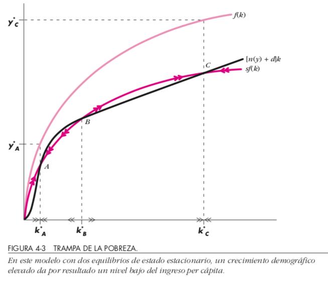

# Clase 9

- Economía de Corta/Mediano/Largo Plazo
- Crecimiento:
    - El crecimiento y la acumulación
    - Modelos de Crecimiento (Solow, Endógeno)
    - Factores
- Productividad
    - Productividad laboral
    - Productividad total de los factores
    - La investigación y desarrollo (I+D)

Lecturas: Dornbush et ali 3, 4, 2.2-2.3  
Proximas: Dornbush et ali 5.1-5.2

---

## Crecimiento y Solow

- Producción y pago a factores
    - PIB como pago a factores
    - Trabajo como principal factor
    - P. Nacional Bruto $PNB=PIB+$pago factores en el extranjero DG2.5
    - P. Interno Neto $PIN=PIB-\text{depreciación}$

{height=50%}\

---

- Contabilidad de crecimiento 
$$Y=A\cdot F(K,N)$$

$$\frac{\Delta Y}{Y}=\theta\frac{\Delta K}{K}+(1-\theta)\frac{\Delta N}{N}+\frac{\Delta A}{A}$$
$$\frac{\Delta y}{y}=\theta\frac{\Delta k}{k}+\frac{\Delta A}{A}$$
    - Ejemplo con Cobb Douglas  
    - Participación Capital y Trabajo ([Exposición De Gregorio](http://static.fen.uchile.cl/2019/04/pdf/pensiones.pdf))
    
    
---

- Residuo de Solow $\frac{\Delta A}{A}$
- Otros factores: Recursos Naturales, Capital Humano
- Modelo Neoclásico
    - $Y=F(K,N)=y=F(k,1)=f(k)$
    - $\Delta k=s\cdot y-(n+d)k$
    - Estado estacionario $\Delta k=0$
    
---

{height=70%}\

Impacto variaciones: $s,A,n,d$

---

## Crecimiento endógeno $Y=aK$

{height=70%}\

---

{height=70%}\

---

- Notebooks
    - [Macroeconomics with python](http://www.ncachanosky.com/macroeconomics-with-python.html)
    - [solowPy](https://github.com/solowPy/solowPy)
    - [seminario](https://dev-ii-seminar.readthedocs.io/en/latest/notebooks/jupyter_notebooks.html)
    - [Braddelong](https://nbviewer.jupyter.org/github/braddelong/LSF18E101B/blob/master/Solow_Growth_Model-Initial_Computations.ipynb)
    
    
---    
    
    
# Clase 10

- Demanda Agregada y Oferta Agregada:
    - Teoría cuantitativa del dinero
    - Gráfico de la Oferta Agregada
- Demanda + Oferta Agregada:
    - Gráficos
    - Enfoques extremos: Clásico y Keynesiano
    - Brecha Producto Potencial y Brecha Gasto Producto
- Curva de Phillips 

Lecturas: Dornbush et ali 5.1-5.2, DG 2-2.1.1  
Próximas: Dornbush et ali 5.3-5.6

---

# Feedback controles

- No responden lo que se les pregunta
    - Definen conceptos
    - Relacionan con otras cosas
    - Muchos datos cuando no se pedían
- Responden en base a a pautas de pruebas pasadas 
    (no hay internalización de contenido)
- Actualidad
    - variables (confusión IMACEC vs IPC)
    - no leerse noticias de manera sistemática
    - dejar respuestas en blanco
    - no están entendiendo las variables (usar glosario)
    - En este ramo la actualidad sistemática es fundamental
- General
    - Optimizar tiempo (no colocar demás)
    - Lo que se les pide no lo completan (noticia inflación)

---

   
- Componentes de la demanda - DG2.6
$$Y\equiv C+I+G+XN$$
    - Identidades importantes
    $$C+I\equiv Y\equiv C+S$$
    $$\underbrace{YDisp}_{C+S}-TRedis-TAx\equiv C+I+G+XN$$

---

{height=85%}\

---

# Modelo OA-DA

- (OA): para cada nivel de precios el monto de producción que las empresas están dispuestas a ofrecer
    - pendiente positiva porque las empresas están dispuestas a abastecer más producción a mayor precio
- (DA): nivel de precios y el nivel de producción en el que los mercados de bienes y de dinero están en equilibrio simultáneamente
    - pendiente negativa 
        - precios altos reducen el valor de la oferta monetaria
        - aminora la demanda de productos

